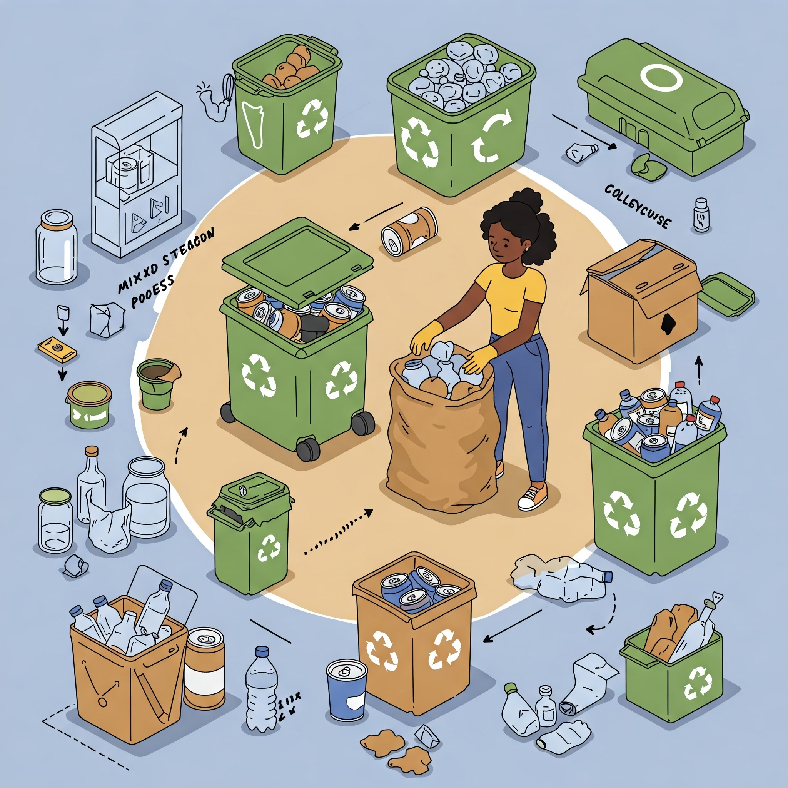

# RecycleMate - Your Guide to Sustainable Recycling



RecycleMate is a comprehensive web application designed to educate and guide users about proper recycling practices and sustainable waste management. The platform provides detailed information about recycling different materials, resources for sustainable living, and tools to help users make environmentally conscious decisions.

## Features

- **Interactive Recycling Guides**: Detailed information about recycling different materials (plastic, paper, glass, metal, electronics)
- **Educational Resources**: Links to government organizations, educational materials, and local recycling information
- **Contact System**: User-friendly contact form with backend processing
- **Responsive Design**: Fully responsive layout that works on all devices
- **Modern UI**: Clean and intuitive interface with animations and visual elements

## Technologies Used

- **Frontend**:
  - HTML5
  - CSS3
  - JavaScript
  - Font Awesome Icons
  - Google Fonts (Poppins)

- **Backend**:
  - PHP
  - MySQL

## Installation

1. **Prerequisites**:
   - XAMPP (or similar local server environment)
   - Web browser
   - MySQL database

2. **Setup Steps**:
   - Clone or download this repository to your XAMPP htdocs folder
   - Start Apache and MySQL services in XAMPP
   - Create a new MySQL database named `user_support`
   - Import the database schema (if provided)
   - Access the website through `http://localhost/RecycleGuide Project/`

## Database Configuration

The project uses the following database settings:
```php
$host = "localhost";
$user = "root";
$password = "";
$dbname = "user_support";
```

## Project Structure

```
RecycleGuide Project/
├── homepage.php          # Main landing page
├── Aboutus.php           # About Us page
├── resources.php         # Educational resources
├── contact.php           # Contact form page
├── contact_back.php      # Contact form backend processing
├── style.css            # Main stylesheet
├── c_style.css          # Contact page styles
├── r_style.css          # Resources page styles
├── a_style.css          # About page styles
└── Image.jpg            # Project logo/image
```

## Features in Detail

### 1. Homepage
- Interactive recycling guides for different materials
- Statistics and facts about recycling
- Quick access to all main features

### 2. About Us
- Project mission and vision
- Team information
- Goals and objectives

### 3. Resources
- Links to government organizations
- Educational materials
- Local recycling information
- PDF guides and infographics

### 4. Contact System
- User-friendly contact form
- Input validation and sanitization
- Database integration
- Success/error handling

## Contributing

Contributions are welcome! Please feel free to submit a Pull Request.

## License

This project is licensed under the MIT License - see the LICENSE file for details.

## Contact

For any queries or support, please contact:
- Email: support@recyclemate.com
- Phone: (555) 123-4567
- Address: 123 Green Avenue, Amritsar, Punjab, India

## Acknowledgments

- Font Awesome for the icons
- Google Fonts for the typography
- All contributors and supporters of the project 